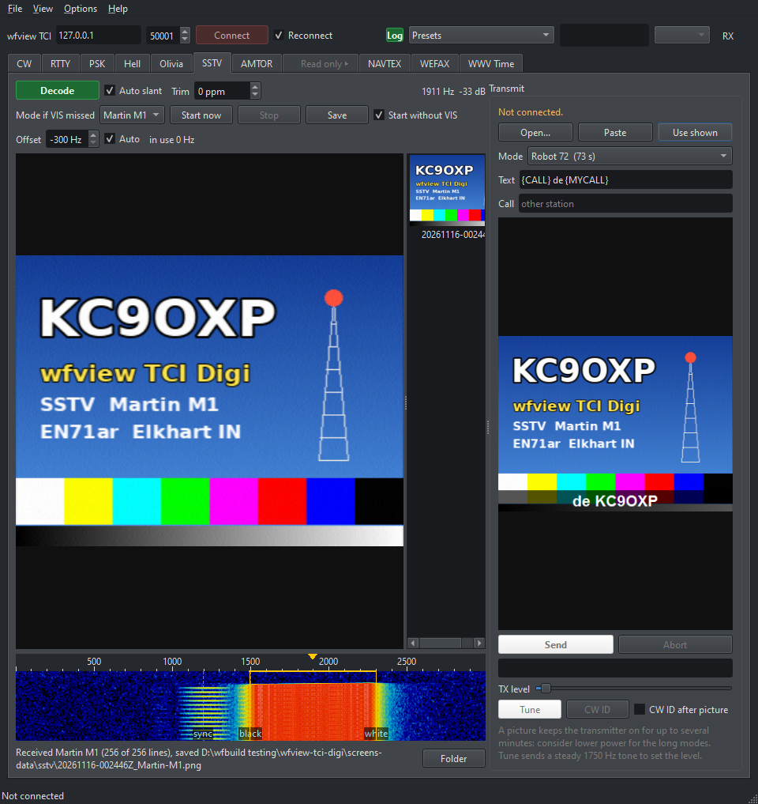
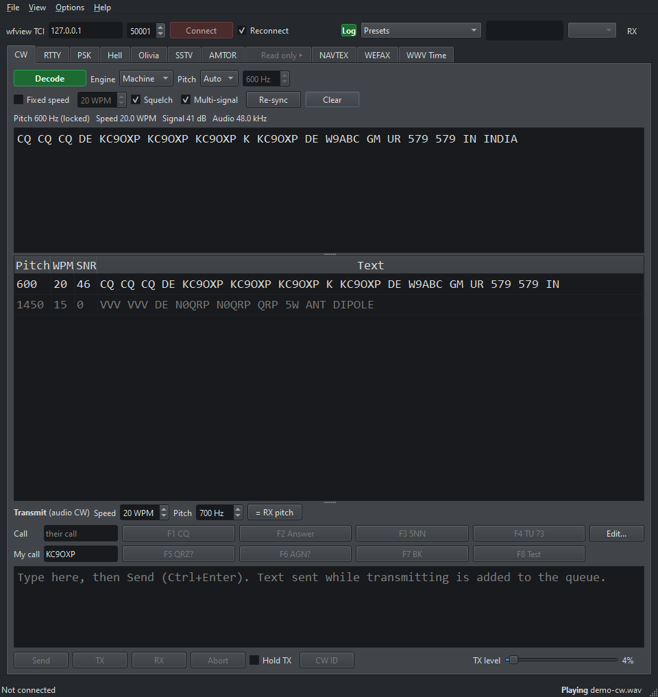
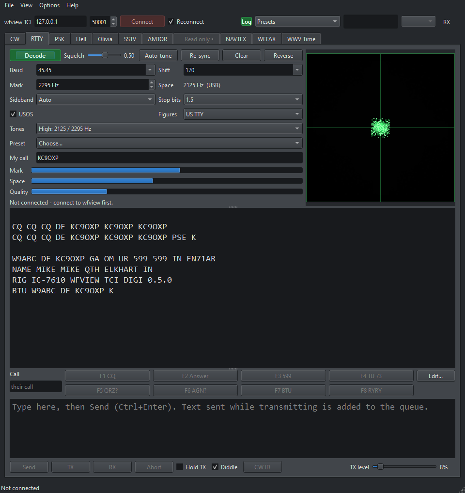
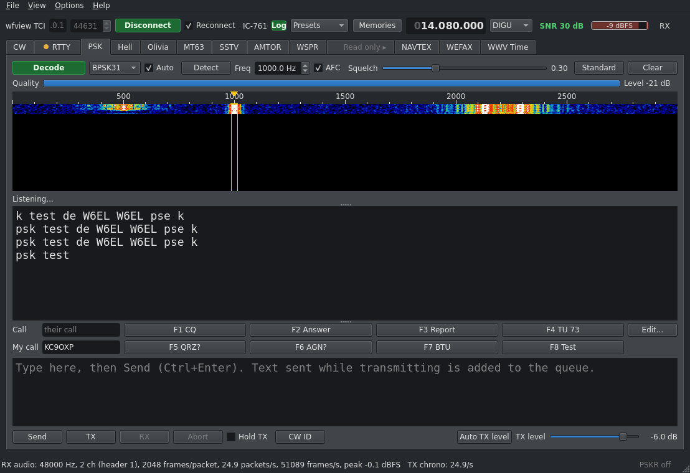
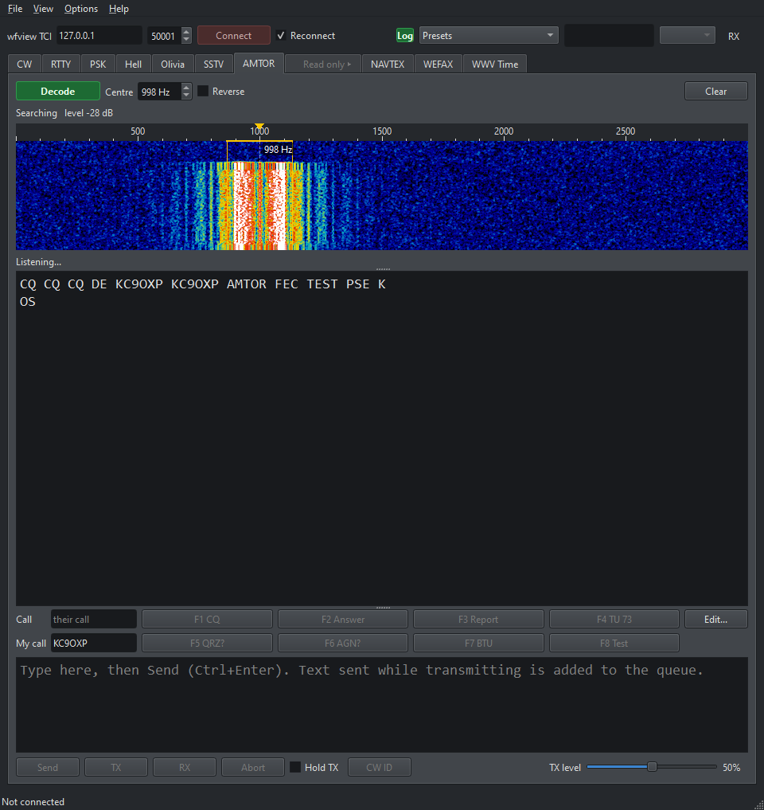
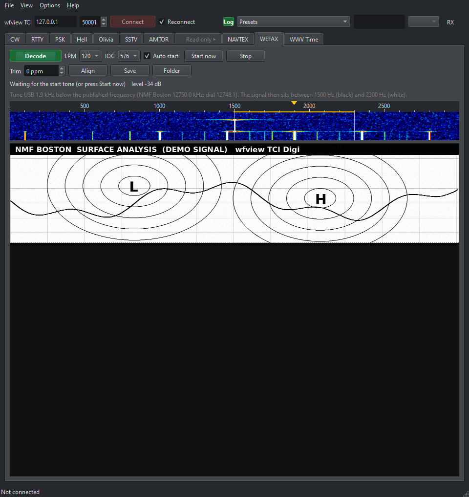
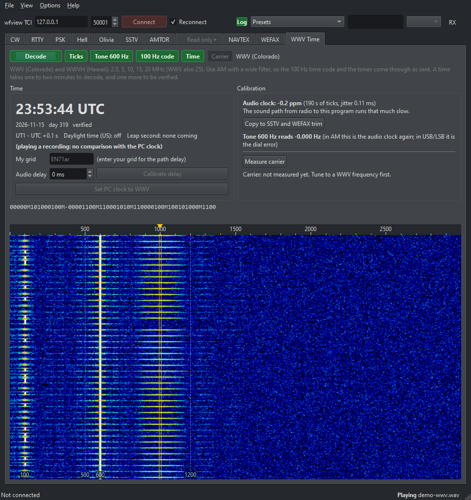

# wfview TCI Digi

> [!WARNING]
> **Alpha release: not fully developed and still very much in testing.**
> Expect bugs, rough edges and changes between versions. So far it has been used on one
> station: an IC-7610 and an FT-991A, each with wfview v3. When you transmit, start into a
> dummy load or at low power and keep an eye on the radio. Bug reports and test results
> are welcome in the Issues tab.

**wfview TCI Digi** is a stand-alone digital-modes program for **wfview**. wfview runs
the radio; this program connects to wfview's **TCI** server (Transceiver Control
Interface) and gets the receive audio, sends transmit audio and keys PTT through it.
One connection, no virtual audio cables, no extra CAT port, and it works the same whether
wfview reaches the radio over LAN or over USB.



> **Unofficial companion.** This is not (yet) part of the wfview project. It is offered
> to the wfview team for possible adoption; see [Future](#future).

## At a glance

| Mode | Receive | Transmit | In short |
|---|:-:|:-:|---|
| **CW** | yes | yes (audio CW) | Two decoders (keyer and hand key), auto pitch and speed, a list of every CW signal in the passband |
| **RTTY** | yes | yes (AFSK) | Any baud and shift, crossed-ellipse tuning scope, auto-tune, presets |
| **PSK** | yes | yes | BPSK31, BPSK63, BPSK125; click a signal on the waterfall to tune it |
| **Feld Hell** | yes | yes | Painted receive with auto column alignment and 30 minutes of scrollback |
| **Olivia / Contestia** | yes | yes | All the usual tone/bandwidth settings; interoperates with fldigi |
| **SSTV** | yes | yes | Martin, Scottie, Robot, PD modes; auto start, auto slant, auto offset; send a picture with CQ / answer / report / 73 text and a timestamp |
| **AMTOR FEC** | yes | yes | Mode B (SITOR-B style), 100 baud |
| **NAVTEX** | yes | - | 518 / 490 kHz and SITOR-B on HF |
| **WEFAX** | yes | - | HF weather fax, 60-240 LPM, straightens and saves the chart |
| **WWV Time** | yes | - | Decodes the WWV / WWVH time code; checks the PC clock, the sound-card clock and the radio's dial accuracy |

Around the modes:

- **Logging:** a session log of everything decoded and sent, and a QSO log that writes
  ADIF for QRZ, LoTW or any logger.
- **Never miss a signal:** long scrollback in every receive pane, a few minutes of
  waterfall history, and the last 2 minutes of receive audio always kept in memory.
- **Try it without a radio:** play any WAV recording into the decoders.
- **Screenshots** of the window or a waterfall with one key, stamped with call, time,
  frequency and mode.
- **Transmit safety:** TX time limit, ALC warning, power/ALC/SWR in the top bar,
  watchdogs that drop PTT if anything stalls.

## Quick start

*This app requires wfview v3 or newer, available here: https://github.com/wf-group/wfview/tree/v3-initial*

1. **wfview v3**: *Settings > External Control > TCI Server Port* = `50001`. For transmit,
   also tick *Settings > User Interface > Enable PTT Controls*.
2. Connect wfview to the radio as usual.
3. Put the radio in a **data mode whose audio input matches how wfview connects** (LAN or
   USB). This is radio-specific; see
   [Radio data mode and modulation input](#radio-data-mode-and-modulation-input).
4. Start **wfview TCI Digi**, enter `127.0.0.1` (or the computer running wfview) and
   `50001`, and press **Connect**. The button turns green ("Disconnect") when connected.
5. Pick a tab and press **Push To Decode**. To transmit, set *My call*, then type and
   press *Send* (or use the F1-F8 macros). Start with a low *TX level* and keep ALC near
   zero.

**Windows:** download the zip from [Releases](https://github.com/KC9oXP/wfview-tci-digi/releases),
unzip it anywhere and run `wfview-tci-digi.exe` (if a DLL is missing, run
`vc_redist.x64.exe` from the same folder first). **Linux (x86-64):** download
`wfview-tci-digi-<version>-x86_64.AppImage` from the same page, then
`chmod +x wfview-tci-digi-*.AppImage` and run it (no install needed; built on Ubuntu 22.04, so
most current distributions work). **macOS:** build from source (see [Building](#building)).

## Screenshots

Taken with the demo recordings played in through *File > Play a WAV file*, so every tab
shows a clean signal. On the air the same tabs work on the radio's receive audio.

| CW (multi-signal list) | RTTY |
|---|---|
|  |  |

| PSK (BPSK31) | Feld Hell |
|---|---|
|  |  |

| Olivia 8/500 | AMTOR FEC |
|---|---|
|  |  |

| NAVTEX | WEFAX |
|---|---|
|  |  |

| WWV Time | SSTV |
|---|---|
|  |  |

---

## The modes in detail

The tabs that can transmit (CW, RTTY, PSK, Hell, Olivia, SSTV, AMTOR) come first; a
*Read only* divider separates the receive-only tabs (NAVTEX, WEFAX, WWV Time). Every
*Decode* button is dark red and reads "Push To Decode" when off, and green "Decode" when
on. Only one tab transmits at a time; *My call* is shared by all tabs.

### CW (receive and transmit)

- Two decoders: *Machine* (ggmorse, for keyers and computer-sent CW) and *Hand key*
  (learns each sender's timing).
- Pitch: Auto (strongest steady tone, 200-1200 Hz) or Fixed (200-3000 Hz; Hand key is
  used above 1900 Hz). Auto or fixed speed, squelch, re-sync.
- The squelch opens only after the tone has been there for half a second and closes a
  second after it stops, so noise before a signal and AGC recovery after one do not print.
- *Multi-signal*: every CW signal from 200 to 2000 Hz with its pitch, speed, SNR and
  text. Double-click a row to decode that station.
- Transmit as **audio CW**: a keyed tone sent as TX audio with the radio in a data mode,
  the way fldigi does it. On the air it is a normal CW signal at the dial frequency plus
  the pitch. Speed 5-60 WPM, pitch 300-1500 Hz (*= RX pitch* puts you on the station you
  are decoding), 5 ms shaped edges (no key clicks), prosigns `<SK>` `<AR>` `<BT>` `<KN>`
  `<BK>`. (wfview's TCI server has no command for the radio's own CW keyer yet.)

### RTTY (receive and transmit)

- Any baud and shift (45.45/50/75/100 bd, 170/200/425/850 Hz presets), 1/1.5/2 stop
  bits, USOS, US TTY or ITA2 figures, Reverse.
- Mark/space filter demodulator with W7AY optimal ATC and a tone-contrast squelch.
- *Tones*: the classic high pair (2125/2295 Hz) or centred on 1500 Hz (1415/1585 Hz, as
  fldigi), so RTTY sits in the middle of a narrow data passband.
- Crossed-ellipse tuning scope, mark/space/quality bars, *Auto-tune* (finds the tone pair
  in the last few seconds and sets Mark). While transmitting, the scope shows your own
  tones with a red *TX* in the corner: the clean "+" of a perfectly tuned signal, to
  compare received stations with.
- *Standard*: back to the amateur standard in one click (45.45 baud, 170 Hz, 2125/2295 Hz
  with mark on the side the sideband puts it, Sideband Auto, Reverse off, 1.5 stop bits,
  USOS, US TTY figures, squelch 0.50). PSK (BPSK31, AFC, squelch 0.30), Olivia (8/500,
  squelch 5.0), NAVTEX (1000 Hz, Reverse off) and WEFAX (120 LPM, IOC 576, Auto start)
  have one too. Frequencies, trims, calls, macros and TX level are not changed.
- Sideband *Auto* follows the radio (USB/DIGU or LSB/DIGL), so mark lands on the right
  tone without touching Reverse.
- AFSK transmit: 0.30 s of mark before the first character, 0.15 s after the last,
  optional diddle. Double-click a call in the receive pane to put it in the Call field.

### PSK (receive and transmit)

- BPSK31, BPSK63 and BPSK125 with standard Varicode.
- Matched-filter receiver: copies cleanly down to about -4 dB SNR in the signal bandwidth
  in the tests.
- Waterfall (0-3 kHz): click a signal to tune (the click snaps to the signal's centre),
  mouse wheel for 1 Hz steps. AFC within one baud, phase-quality squelch with a quality
  bar.
- Transmit on the receive frequency: idle reversals before the text and a shaped fade-out
  after it, so no key clicks.

### Feld Hell (receive and transmit)

- Standard Feld Hell: 7-column characters, 245 pixels a second, shaped keying (more than
  40 dB down outside +/-250 Hz).
- Receive is painted, not decoded, like every Hell program. Each column is drawn twice
  so drifting text stays readable. Zoom 1-4x, contrast, RX trim for slanted text.
- *Auto align* re-cuts the columns so letters are not split top/bottom; manual *Shift*
  as well.
- The last 30 minutes are kept: mouse wheel or PgUp scrolls back (*Live* returns),
  *Save picture* writes a PNG, *Auto-save* keeps one in the logs folder.

### Olivia and Contestia (receive and transmit)

- Olivia 4/125 to 64/2000 and Contestia 4/125 to 64/1000, using Pawel Jalocha's MFSK
  library exactly as fldigi does, so the two interoperate.
- The receiver finds signals a few tone spacings off the set frequency by itself. An S/N
  squelch keeps noise (and the library's junk after a signal ends) off the screen.
- Transmit starts with two FEC blocks of idle (1-4 s) so the far end has locked on before
  the first letter.

### SSTV (receive and transmit)

- Martin M1/M2, Scottie S1/S2/DX, Robot 36/72, PD50/90/120/160/180/240.
- Pictures start on their VIS header. Joined late? *Start without VIS* starts the picture
  when the sync pulses repeat at one mode's line timing (as MMSSTV does), or pick the
  mode and *Start now*. The mode list follows each picture received, and with *Follow
  received* ticked (beside the send mode) the send mode changes to the mode of a picture
  that came in with its VIS header, so you answer in the mode the other station used.
- Tuning: click the middle of the signal on the small waterfall (or drag, or the wheel
  for 1 Hz steps); markers show sync, black and white. *Auto* offset refines it from the
  1900 Hz VIS leader and the 1200 Hz sync pulses.
- *Auto slant* fits a line through every line's sync pulse, so a slanted picture is
  straightened as it comes in; a ppm *Trim* covers a known sound-card clock error.
  *Use when sending* applies the Trim to sent pictures too (worth it only for large
  errors: the note beside it says how many pixels it changes in the chosen mode).
- Pictures are saved as PNG (in 4:3) and shown in a strip to click through.
- Transmit: open or paste a picture (or *Use shown* to send back the one received), pick
  the mode, preview, progress, abort, *CW ID after picture*. While sending, a bright
  yellow line moves down the preview at the line on the air (the part still to go is
  dimmed) and the progress bar reads `line 120 / 240  42 s left`. *Tune* sends a steady
  1750 Hz tone to set the level.
- *Picture text*: pick the line drawn along the bottom of the picture - None, CQ
  (`CQ SSTV de {MYCALL} {GRID}`), Answer (`{CALL} de {MYCALL}`), Report
  (`{CALL} de {MYCALL} UR {RST}`), Thanks, 73, Test or Custom. Each text can be edited
  and is kept (*Default* puts it back). `{MYCALL}` `{CALL}` `{RST}` `{GRID}` `{DATE}`
  `{TIME}` are filled in. The text keeps its normal size: a long message wraps onto more
  lines and the dark band grows upward (up to half the picture; only past that does the
  size step down a little, and what still does not fit ends in "...").
- *Timestamp*: date and time (UTC or local) in a top corner, taken when Send is pressed.

### AMTOR FEC (receive and transmit)

- Mode B (FEC, as SITOR-B): 100 baud, 170 Hz shift, CCIR 476, every character sent twice,
  phasing signals first and the end-of-emission signal last. Typing as you go is fine.
- Receives with the same decoder as NAVTEX; *Reverse* for LSB or inverted stations. On the
  amateur bands AMTOR belongs in the RTTY/data segments.

### NAVTEX / SITOR-B (receive)

- 100 baud, 170 Hz shift, CCIR 476 with the time-diversity FEC repair; bit sync, phasing
  search and FEC after fldigi's NAVTEX decoder.
- 518 kHz / 490 kHz (tune USB 1 kHz below) and SITOR-B on HF.

### WEFAX (receive)

- HF weather fax, 60/90/120/240 LPM, IOC 576/288.
- Starts on the APT start tone, aligns on the phasing lines (and takes the true line
  period from them, so the chart comes out straight), ends on the stop tone, saves a PNG.
  *Start now* for a chart joined late; *Align*, then a click on the chart's left edge,
  moves it into place.

### WWV Time (receive)

Tune WWV or WWVH in AM with a wide filter: WWV (near Fort Collins, Colorado) is on 2.5, 5,
10, 15 and 20 MHz, plus an experimental 25 MHz broadcast that may be off the air; WWVH
(Kauai, Hawaii) is on 2.5, 5, 10 and 15 MHz. The *Go to* buttons at the right of the
lamps tune the radio there in AM; the one you are on is green.

- **Lamps** show what is being heard: second ticks, the 440/500/600 Hz tones, the 100 Hz
  time code, a decoded time, a measured carrier. If *100 Hz code* stays grey while *Ticks*
  is lit, the radio's audio does not pass 100 Hz.
- **Time:** UTC, date, UT1-UTC and the daylight-time and leap-second flags from the 100 Hz
  code. The code has no error check, so a time counts as *verified* when two minutes in a
  row agree (two to three minutes after Decode). WWV or WWVH is told apart by the tick
  tone.
- **PC clock:** how far the computer's clock is from WWV, after taking off the radio path
  (from your grid square) and the audio delay through radio and wfview. *Calibrate
  delay* measures that delay once while the PC clock is known to be right (kept per
  radio). *Set PC clock to WWV* shifts the clock (Windows; asks for administrator rights).
- **Audio clock:** the spacing of the ticks gives the error of the sound path in ppm.
  *Picture trim* shows the SSTV and WEFAX trim and can be changed there; *Copy audio
  clock to trim* puts the measured value in. Only SSTV and WEFAX use it.
- **Tones:** how far the 440/500/600 Hz tones read off.
- **Measure carrier:** tunes 1 kHz below the WWV frequency in USB, then 1 kHz above in
  LSB (about 25 s in all), measures where the carrier lands each time, then puts the radio
  back. A dial error moves the two tones opposite ways, so half their difference is the
  radio's dial error in Hz and ppm; whatever moved both tones the same way (the sound path,
  a sideband offset in the radio) is shown separately and left out.

---

## In every tab

**Transmit**
- Macros F1-F8 with `{MYCALL}` / `{CALL}`, a type-ahead box (text typed while
  transmitting is added to the queue), *Hold TX*, *TX level*, Esc to abort.
- *CW ID*: "DE <your call>" as keyed audio CW. `{CWID}` at the end of a macro sends it
  after the text without dropping PTT (Options > Tune tone, CW ID and Auto TX level).
- *Auto TX level* (left of the TX level slider): sets the tab's TX level from the radio's ALC. It transmits a short test
  signal shaped like the mode (RTTY and AMTOR: mark and space alternating at the baud
  rate; other modes: one tone at the tab's audio frequency, which has the same peaks) and
  finds the highest level whose ALC reading is at or below the target (0.1 by default,
  Options > Tune tone, CW ID and Auto TX level; the scale is whatever wfview reports for the
  radio). With a target of 0 it first raises the level until ALC shows, then backs off
  until it reads 0. Usually 5-20 s; click again to stop. Needs ALC reports (tx_sensors)
  from the server (a server that only reports changed readings is fine). If it is stopped
  or runs out of time it keeps the highest level it found at or below the target, and a
  box says why it stopped.
- The TX level is in dB below full level (0 to -40 dB, 0.5 dB steps; Page Up/Down 3 dB),
  kept per mode, and per sub-mode for PSK31/63/125 and each Olivia / Contestia setting.
- The mode check accepts every data-mode name servers use (DIGU/DIGL, DATA-U/DATA-L,
  USB-D/LSB-D, PKTUSB ...) and plain USB/LSB.

**Frequency box** (top bar): always 9 digits with leading zeros (`001.810.000`), so every digit
up to 100 MHz can be stepped: on 160 m, turn the 10 MHz digit up to go straight to 10 MHz. Point
at a digit and turn the mouse wheel to step it, or click the top half of the digit to step up
and the bottom half to step down. Clicks only step: they never put a text cursor in the box. To
type a frequency (14.080, 14080k): right-click > *Type a frequency...* (or Tab into the box),
type and press Enter; Esc cancels.

**Transmit safety**
- Options > *TX time limit* (default 5 minutes; off, 1-10): the transmitter is released
  after this long keyed, whatever the mode.
- While transmitting, the top bar shows the output power, ALC and SWR wfview reports.
  Options > *ALC warning...* turns the meter red when ALC stays above a limit you set.
  ALC scales differ between radios, so the limit is kept per radio.
- Watchdogs release PTT if the server never asks for TX audio, the radio does not go to
  transmit, or the radio drops out of transmit (e.g. wfview's PTT timeout).
- If the radio keys up but reports no output power, a hint explains what to check (see
  [Radio data mode](#radio-data-mode-and-modulation-input)).

**Top bar**
- *Connect*: red when disconnected, amber "Cancel" while trying, green "Disconnect" when
  connected. With *Reconnect* ticked it keeps retrying every 5 s.
- Frequency and mode, shown and settable.
- *SNR*: live signal-to-noise of the signal on the tab in use (green 10 dB and up, amber
  3-10 dB; `SNR --` below 3 dB, where there is no signal above the noise; `SNR (TX)` while
  transmitting). The signal's strongest spectrum bin is compared with the typical strongest
  bin of same-width stretches of noise elsewhere in the passband, so an empty frequency reads
  about 0 dB; RTTY needs both mark and space and measures the weaker. Same measurement as the
  QSO log's signal report; not WSJT-X's 2500 Hz-referenced SNR.
- *RX input level* (right of SNR, the same on every tab): the receive audio wfview sends, in
  dBFS (0 = full scale). The bar is the average (RMS) level, the thin mark the recent peak.
  Green -50 to -12 dBFS is about right; amber is too quiet or too hot; red means peaks at full
  scale (clipping). Set it with wfview's RX audio level and the radio's AF/RF gain. It is an
  input level, not a signal report: band noise has a level too. Shows `TX` while transmitting
  and `no audio` when wfview sends none.
- *Log*: the session log on (green) or off, for all modes.
- *Presets*: frequency presets for the tab showing (SSTV 3.845 LSB / 14.230 ..., WEFAX NMF
  / NMG with the 1.9 kHz offset, NAVTEX 518 kHz, WWV 2.5-25 MHz AM ...). A preset sets the
  dial and mode over TCI; add the current frequency or edit the list.
- *Memories* (Ctrl+M, also Options > Memories...): a window listing frequencies with their
  tab, sub-mode (BPSK31, Olivia 8/500, RTTY 45.45/170 ...), dial, sideband, band, US
  license classes and a comment. Click one and the app switches to that tab, sets the
  sub-mode and tunes the dial and sideband over TCI (untick *Tune on click* to use
  double-click or Go instead). Filter by tab, by license class (Novice, Technician,
  General, Advanced, Extra, Other) or by text; *New...* adds one by typing it in, *Add
  current...* saves what you are on now. *Other* is a class of your own for things outside the
  US amateur rules (11 m, MARS, another country's bands).
  - The list is `memories.csv` in the data folder, so it can also be edited in Excel or a
    text editor; changes saved there show in the window straight away. Columns: `Name,
    Tab, Sub-mode, Dial MHz, Sideband, Band, Classes, Comment` (Dial MHz also takes Hz or
    kHz, e.g. `14070 kHz`).
  - The first time, the file is made from a built-in list: the digital-mode frequencies of
    the ARRL band plan, common PSK31 / Olivia / SSTV spots (marked as such in the
    comment), the Feld Hell Club's suggested Hell frequencies 160-6 m (dial 1 kHz below,
    so the signal sits at 1000 Hz audio), the US 60 m channels and segment for CW, RTTY,
    PSK31 and Olivia (100 W ERP on the channels, signal centred on the channel at 1500 Hz
    audio; 9.15 W ERP in 5351.5-5366.5 kHz; 2.8 kHz bandwidth), and the NAVTEX, WEFAX and WWV receive frequencies. *Add built-in...* adds any
    built-in entries missing from your list later without touching your own.
  - Classes: an empty Classes cell is worked out from FCC Part 97 (ITU Region 2) for the
    tab's emission (CW, RTTY/data or SSTV image) across the 3 kHz the signal can occupy
    from the dial, e.g. SSTV on 7.171 LSB is Advanced and Extra only, data on 28.120 is open
    to every class, Novice and Technician have CW only on 80, 40 and 15 m. 60 m follows the
    FCC rules from 13 February 2026: General and up, CW / data / USB phone only, on the four
    channels centred on 5332, 5348, 5373 and 5405 kHz (USB dial 1.5 kHz below) and anywhere
    in 5351.5-5366.5 kHz. This is a guide: check the current rules before transmitting.

**PSK Reporter** (status bar button, Options > *PSK Reporter...*): sends the callsigns this
station hears to [pskreporter.info](https://pskreporter.info), where they show on the map.
- Off until you turn it on. The button shows *PSKR off*, or *PSKR* and the number of spots sent
  (green; amber when something needs attention, e.g. no grid). Click it to turn reporting on or
  off; the first time it asks for your call and grid (the call is the same My call that every
  transmit tab and the QSO log use, so it can be typed here on a fresh install).
  Right-click for the settings.
- What is reported: every QSO you log, and, with *Auto-detect* ticked, any call seen once
  right after CQ, DE or 73 (`CQ DE W1AW K`, `73 W1AW SK`; one over is enough) in the CW, RTTY,
  PSK, Olivia/Contestia and AMTOR tabs, each call at most once per 10 minutes. After 73 the call
  counts only if DE does not follow it (`TU 73 K1ABC DE W1AW` reports W1AW, not K1ABC, who was
  only being thanked). Text you send is never read.
- As the PSK Reporter developer page asks: at most one report every 5 minutes (timed from when
  you turn it on, not the clock), each call at most once per 5 minutes and otherwise once an
  hour unless it moves band; mode names are ADIF (CW, RTTY, PSK31, OLIVIA, CONTESTI,
  AMTORFEC). A *test server* option sends to PSK Reporter's packet checker instead of the map.

#### GridTracker (live frequency and heard calls)

*Options > GridTracker (live frequency and heard calls)...* (off until turned on) sends GridTracker2
the dial frequency, band, mode, your call and grid every 15 seconds and whenever they change, and the
calls heard in the CW, RTTY, PSK, Olivia/Contestia and AMTOR tabs right after CQ, DE or 73, each call at
most once a minute, so they show on its map. The heard calls appear as `CQ W1AW` (a CQ), `K1ABC W1AW`
(W1AW calling K1ABC; calls to you are highlighted by GridTracker) or `DE W1AW`. It uses the same UDP
message format WSJT-X sends, to 127.0.0.1 port 2237 by default (GridTracker2: Settings > General >
Receive UDP Messages, port 2237). Logged QSOs still reach GridTracker through *Logging and uploads*
(ADIF, port 2333). Text you send is never read.

**Logging and uploads** (Options > *Logging and uploads...*; status bar *QRZ* / *LoTW*): every
logged QSO is always written to the ADIF file. Each one can also go, as soon as it is logged:
- *To another program* as an ADIF record over UDP, e.g. GridTracker2 (Settings > General >
  Receive ADIF UDP Broadcasts For Logging, port 2333), which then uploads with its own LoTW / QRZ
  settings. Nothing secret is stored in this app.
- *Straight to your QRZ.com logbook* with its logbook API key (QRZ subscription needed). *Test key*
  answers Pass or Fail.
- *Straight to LoTW*: TQSL signs and uploads in the background (no TQSL window, no password to type)
  with the certificate password saved once, or none if the certificate has no password. TQSL is found
  where its installer put it; the station location is the name set up in TQSL.
- A QSO that cannot be sent (no internet) waits and goes with the next one; *Retry now* sends it at
  once. A login problem (wrong key or password) stops that service and turns its button red until it
  is fixed, instead of trying again and again. Status bar: green sent, blue sending, amber waiting,
  red stopped.
- Security: the key and password are kept in Windows Credential Manager, never in a file, and shown
  only as stars. When used, a secret is decrypted into locked memory (kept out of the page file and
  encrypted in place while it waits), handed to the HTTPS request or TQSL, and wiped. The QRZ address
  is built in (a settings file cannot point the key elsewhere), redirects are not followed, every
  field is encoded, and nothing secret is written to the logs (TQSL's command line is shown with
  `-p ********`). Outside Windows there is no supported store yet, so secrets last only until the
  app closes. As with any program, malware running as your Windows user could still read them.

**Logs, scrollback, screenshots, recordings**
- *Session log*: everything decoded and sent, a text file per mode per UTC day, with a
  header line for each change of frequency or settings.
- *QSO log* (View > QSO log, Ctrl+Shift+Q): Call / RST / Name / QTH / Grid / Comment with
  frequency, band, mode and times filled in; *Log QSO* (Ctrl+L) appends an ADIF record
  (`wfview-tci-digi.adi` in the logs folder, for QRZ, LoTW via TQSL, or any logger that imports
  ADIF). Double-click a callsign in any receive pane (or right-click > *Log <call>*) to put it
  in the QSO log's Call box.
- *Callsign lookup* (Options > *Callsign lookup (QRZ / HamQTH)...*, off until set up): when a
  call is entered, Name, QTH and Grid are filled in from QRZ.com (your QRZ username and password,
  not the logbook API key; without a QRZ XML subscription QRZ gives name and address but no grid)
  or from HamQTH (free account). Only empty boxes are filled. *Save and test* logs in and looks up
  your own call. The password is kept like the other secrets (Windows Credential Manager); each
  call is looked up once per session.
- *Add signal report to the comment* (on by default): logging adds e.g. `SNR 18 dB, S7` to the
  comment. The SNR is the signal's peak over the noise floor in the receive spectrum, at the
  frequency of the tab in use, smoothed over a few seconds and never measured while you transmit
  (it is not WSJT-X's 2500 Hz-referenced SNR); below 3 dB it is left out. The S-meter is asked from wfview (TCI `rx_smeter`,
  dBm, S9 = -73 dBm); if wfview does not answer, only the SNR is added.
- Receive panes keep a long history: scroll back and the view stays put while new text
  arrives (*Live* returns), Ctrl+F finds text, right-click saves it.
- Waterfalls keep the last few minutes: Shift+wheel or PgUp/PgDn scrolls back, Esc
  returns to live; right-click saves a picture.
- File > *Save window screenshot* (F12) and *Save waterfall picture* (Ctrl+Shift+S).
- File > *Save the last 2 minutes of receive audio* (Ctrl+Shift+A), or *Record receive
  audio* for as long as you like.
- File > *Play a WAV file into the decoders* (real time or 4x): every tab decodes it as
  if it came from the radio.
- Everything goes in one data folder (Options > Data folder; default
  Documents/wfview TCI Digi): logs, sstv, wefax, screenshots, recordings.

**TCI and diagnostics**
- *View > TCI log*: connection messages plus a box to send raw TCI commands.
- The status bar shows the receive and transmit audio streams once a second (rate,
  channels, frames per packet, packets/s, peak level, how TX is paced), and says so when
  wfview sends receive audio that is all zeros (see the notes below).

**Updates**
- At every start the program asks GitHub whether a newer release exists. If one does,
  the status bar shows "Version x.y.z is available": click it to open the release page,
  or *skip* to hear no more about that version. Nothing is installed for you.
- Help > *Check for updates...* asks at any time and shows links to the release page and
  to the download for your computer (Windows zip or Linux AppImage). Options > *Check for
  updates at start-up* switches the start-up check off.
- The only thing sent is the request for the public list of releases.

---

## Setting up wfview (v3)

wfview **v3** is required. wfview 2.24 answers TCI (the radio, frequency and mode show
up) but never sends TCI audio, so the status bar stays at "RX audio: none".

1. **Settings > External Control > TCI Server Port**: set a port to enable the TCI server
   (0 = disabled). The default is **50001**.
2. Set up wfview's receive audio as usual (LAN audio, or the radio's USB audio codec).
3. For transmit: tick **Settings > User Interface > Enable PTT Controls**, and put the
   radio in a data mode (**DIGU** / USB-D or **DIGL** / LSB-D). The program warns if the
   radio is in a mode that does not take computer audio.
4. Connect wfview to the radio (wfview refuses TCI clients while no radio is connected).
5. Start wfview TCI Digi, enter the computer running wfview (127.0.0.1 if it is the same
   one) and port, and press **Connect**. *Options > Connect on start* connects as soon as
   the program opens.

## Radio data mode and modulation input

Every transmit mode here sends **audio**. The radio only puts that audio on the air if it
is in a data (or SSB) mode **and** that data mode takes its audio from the input wfview is
feeding: the LAN input when wfview connects over the network, the USB input when it
connects over USB. Get this wrong and the radio keys up with no output power.

How to set it depends on the radio. On Icom radios each data mode (D1, D2, D3; *Data 1/2/3*
in wfview) has its own modulation input (DATA MOD: MIC, ACC, USB, LAN). Check, in the
radio's menu or in wfview's *Settings > Radio Settings > Current transmit modulation
source*:

1. which input each data mode uses, and
2. that wfview has the radio in the data mode whose input matches the connection.

Example (the author's IC-7610): DATA1 = USB, DATA2 = LAN, DATA3 = ACC, so with wfview on
LAN the radio must be in **Data 2**. wfview can set the inputs every time it connects:
*Set transmit mod input sources on connect*, with Data On = LAN (or USB).

Set the data mode in wfview. Choosing DIGU/DIGL in this program's mode box switches wfview
to **Data 1**, whatever data mode the radio was in (see the notes below).

A radio's data mode can also narrow its receive audio. On the FT-991A in DATA-U the audio
was cut above about 1.5-1.8 kHz, which spoils SSTV; plain USB was fine.

## Building

Qt 6 (Widgets, WebSockets, Network), a C++17 compiler.

```
mkdir build && cd build
qmake ../wfview-tci-digi.pro CONFIG+=release
make          # nmake with MSVC on Windows
```

Tests. The modems are Qt-free engines (`engine/`), each tested encoder -> decoder with
noise, clock error and frequency offsets:

```
# Protocol helpers, RTTY and CW through TCI frames
g++ -std=c++17 -O2 -Isrc -Iengine tests/test_protocol.cpp src/tciprotocol.cpp engine/rttycore.cpp engine/rttytxsource.cpp -o test_protocol
g++ -std=c++17 -O2 -Isrc -Iengine -Iengine/ggmorse/include tests/test_cw.cpp src/tciprotocol.cpp engine/ggmorse/src/ggmorse.cpp engine/ggmorse/src/resampler.cpp -o test_cw
# PSK and Feld Hell
g++ -std=c++17 -O2 -Iengine tests/test_psk.cpp engine/pskcore.cpp -o test_psk
g++ -std=c++17 -O2 -Iengine tests/test_hell.cpp engine/hellcore.cpp -o test_hell
# CW transmit (keyer timing, key clicks, prosigns, loopback through the CW decoder)
g++ -std=c++17 -O2 -Isrc -Iengine -Iengine/ggmorse/include tests/test_cwtx.cpp engine/cwtxcore.cpp engine/modemtxsource.cpp engine/pskcore.cpp engine/hellcore.cpp engine/ggmorse/src/ggmorse.cpp engine/ggmorse/src/resampler.cpp -o test_cwtx
# SSTV, WEFAX, NAVTEX / AMTOR FEC, Olivia / Contestia, WWV
g++ -std=c++17 -O2 -Iengine tests/test_sstv.cpp engine/sstvcore.cpp -o test_sstv
g++ -std=c++17 -O2 -Iengine tests/test_wefax.cpp engine/wefaxcore.cpp -o test_wefax
g++ -std=c++17 -O2 -Iengine tests/test_navtex.cpp engine/navtexcore.cpp -o test_navtex
g++ -std=c++17 -O2 -Iengine tests/test_olivia.cpp engine/oliviacore.cpp -o test_olivia
g++ -std=c++17 -O2 -Iengine tests/test_wwv.cpp engine/wwvcore.cpp -o test_wwv
g++ -std=c++17 -O2 -Iengine tests/test_version.cpp -o test_version
g++ -std=c++17 -O2 -Iengine tests/test_txlevel.cpp -o test_txlevel
g++ -std=c++17 -O2 -Iengine tests/test_freqdigits.cpp -o test_freqdigits
# Memories file format and license-class rules (the argument also checks the built-in list)
g++ -std=c++17 -O2 -Iengine tests/test_memories.cpp -o test_memories && ./test_memories resources/memories-builtin.csv
# PSK Reporter datagrams (checked byte for byte against the sample on pskreporter.info/pskdev)
# and callsign spotting in decoded text
g++ -std=c++17 -O2 -Iengine tests/test_pskreporter.cpp -o test_pskreporter
# Log uploads: QRZ form encoding and replies, TQSL command line and status codes
g++ -std=c++17 -O2 -Iengine tests/test_upload.cpp -o test_upload

# End to end against a mock of wfview's TCI server (~3 min); --new runs only the
# newer parts (WAV playback into the newer decoders, logs, Olivia / SSTV / AMTOR
# transmit, Tune and CW ID)
qmake ../tests/test_e2e.pro && make && g++ -std=c++17 -O2 ../tests/fake_tqsl.cpp -o fake_tqsl
QT_QPA_PLATFORM=offscreen ./test_e2e
```

`test_e2e --serve 50001` runs only the mock server, which plays an RTTY station
(2125/2295 Hz), a BPSK31 station (1000 Hz) and a Feld Hell station (500 Hz), decodes the
RTTY, BPSK31 and CW you transmit, and reports TX power from your audio, so the program can
be tried without a radio.

## Notes on wfview's TCI server (v3, November 2026)

Found while writing this client; the client works around each one.

- **RX audio header channel count.** wfview announces `audio_stream_channels:2` and sends
  interleaved stereo (2048 frames = 4096 floats per packet), but writes `channels = 1` in
  every RX audio frame header. A client that trusts the header reads the stream as mono at
  half speed. This client trusts the announced count when the server is wfview.
- **TX audio format is fixed.** wfview's TCI TX input expects 48 kHz stereo float32 and
  ignores the TX frame's header (rate, channels). This client always sends that.
- **TX pacing.** wfview sends a TX chrono frame only in front of each RX audio frame. If
  RX audio stopped while transmitting, so would the chrono frames; this client then paces
  TX audio from its own clock (the status bar says which is in use).
- `modulations_list` reports FM as `FM`, but `modulation` reports it as `nfm`.
- TCI has no command for the radio's CW pitch, so the CW decoder has no "follow radio
  pitch" mode here.
- **No CW keying over TCI.** wfview's TCI server does not implement `cw_macros`, so CW
  transmit here is audio CW.
- **DIGU/DIGL always mean Data 1.** A TCI `modulation:0,digu;` puts the radio in USB with
  data mode D1, even if it was in D2 or D3. On a radio whose D1 input is not the one wfview
  feeds, transmit goes silent. Set the data mode in wfview instead.
- **Silent RX audio.** Seen once (wfview 3.00, IC-7610, November 2026): wfview kept sending
  RX audio packets at the normal rate, but every sample was zero (`peak -120.0 dBFS`,
  empty waterfalls). Restarting wfview cured it. The status bar now says so (not while
  transmitting: wfview sends zeros for receive audio then, and that is normal).
- **`tx_sensors_enable` argument order.** The TCI spec is `tx_sensors_enable:true,<ms>;`;
  wfview 3.00 reads the enable flag from the second argument, so this client sends
  `tx_sensors_enable:0,true;` to wfview. wfview then sends `tx_sensors` with its ALC meter
  in the "mic" field.

## Background

It started as the CW decoder and RTTY window proposed for wfview v3 (wf-group/wfview PRs
#151 and #152). On #152, Elliott (W6EL) suggested building it as a separate program that
talks to wfview over TCI, so wfview v3 can ship without it and wfview's TCI server gets a
real client to test against.

## Easter egg

Options > *STANAG 4481 Easteregg* (on by default). NATO STANAG 4481 FSK shore-to-ship
broadcasts (usually 75 baud, 850 Hz shift; the RTTY tab has a preset for it) are synchronous
and encrypted, so an RTTY decoder prints random characters and the stop bit is right only
about half the time; amateur RTTY always has its stop bits. When the RTTY tab has been locked
on such a signal for 10 seconds and at least 10 characters look like that, it prints one
line in tribute to the 1991 Mega Drive port of Zero Wing, then carries on with the random
characters. Once per signal; it is not written to the session log and never reaches PSK
Reporter or GridTracker.

## Future

- CW with the radio's own keyer once wfview's TCI server supports `cw_macros`.
- More modes (QPSK31/63, MFSK16/32, DominoEX/THOR, MT63 are candidates), each as a Qt-free
  engine with tests, the same way the others are written. WEFAX transmit. CHU as a second
  time source.
- The goal is for this to become part of wfview if it fits the wfview team's plans: as a
  companion program in the wf-group organization, as a second program built from the
  wfview tree, or folded back into wfview itself after v3. The engines have no Qt
  dependency and the code follows wfview's `.clang-format`, Qt version, qmake build and
  GPLv3 license, so any of these should be straightforward.

## License

GPLv3 (see LICENSE). The CW and RTTY engines come from the author's wfview work. The PSK,
Feld Hell, SSTV, WEFAX and WWV engines and the 5x7 Hell font were written for this program
(SSTV and WEFAX mode timings from the published specifications and QSSTV's tables; WWV
from NIST's published format). `engine/ggmorse` is ggmorse by Georgi Gerganov, MIT
license (see its LICENSE). `engine/jalocha` is Pawel Jalocha's Olivia/Contestia MFSK
library as distributed with fldigi (GPL); the NAVTEX decoder follows fldigi's (GPL) - see
`engine/jalocha/README-WFVIEW.txt`.
